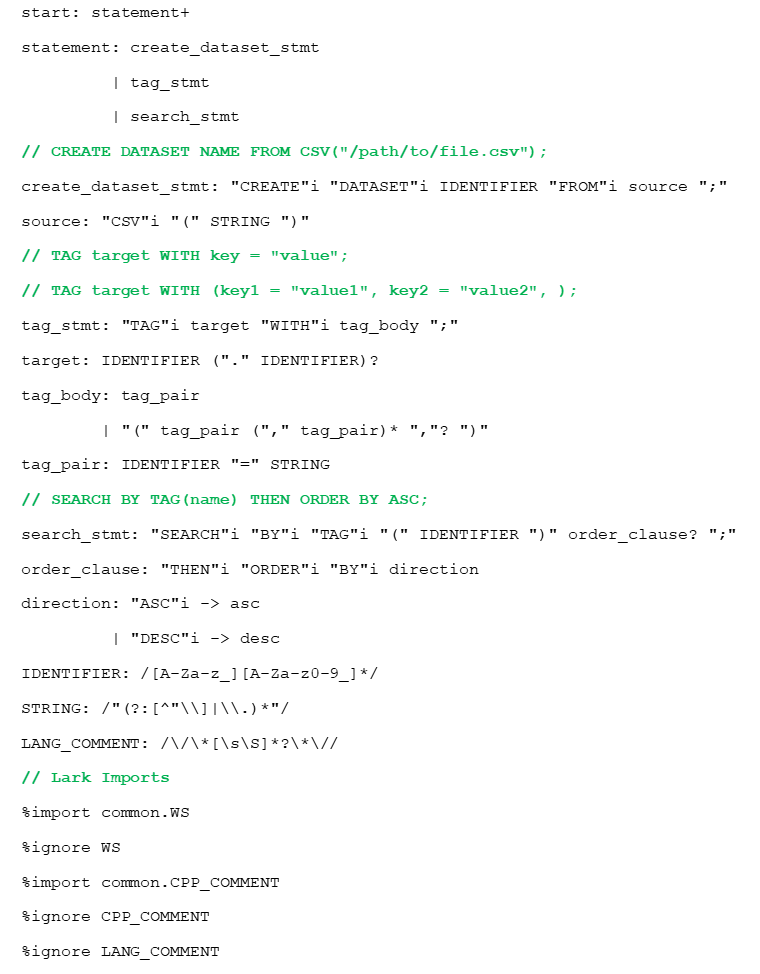
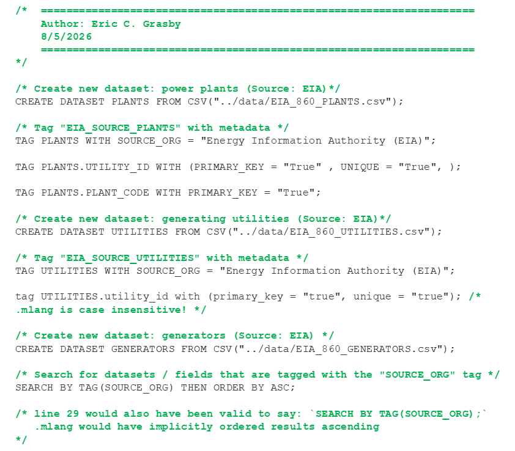
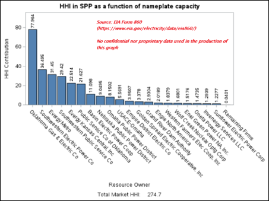
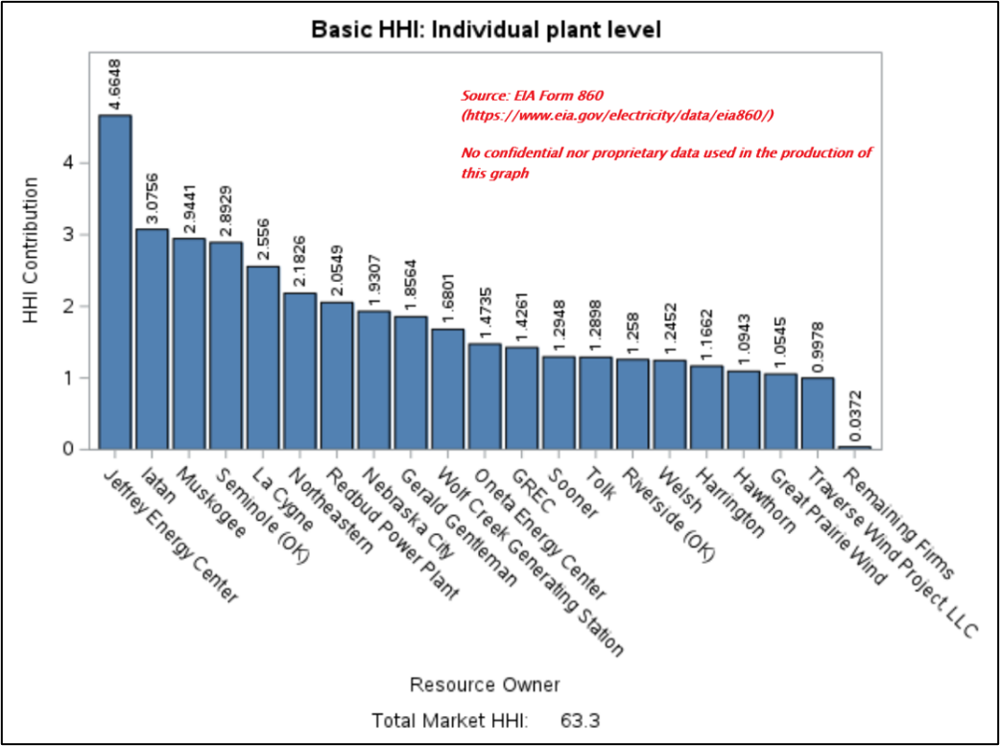

# Appendix

This is the appendix for "A Domain-Specific Computer Language for Market Monitoring: From Domain Logic to SAS Code"

## Appendix A: Initial Mlang Lark Grammar

## Appendix B: Sample Mlang Program

## Appendix C: Herfindahl-Hirschman Index (HHI)

HHI is a classic measure of _market concentration_, and is commonly used to assess if a merger/acquisition (M&A) between large firms will result in a monopoly. It is often used in electricity markets for similar means. One of the aims of Monitor Language is to allow the user to create visualizations & metrics from source data. The below figures are included as examples of what could be created using the MLang prototype: 

